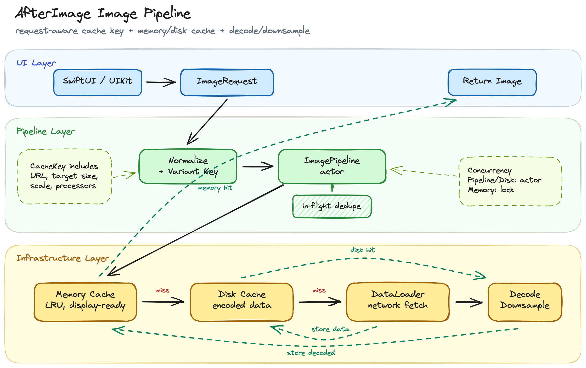

# AfterImage

`AfterImage`는 iOS 앱에서 반복되는 이미지 다운로드, 디코딩, 캐싱 비용을 줄이기 위한 Swift 기반 이미지 캐시 라이브러리입니다.

<!--단순한 `URL -> UIImage` 헬퍼가 아니라, `ImageRequest`를 기준으로 메모리 캐시, 디스크 캐시, 네트워크 로드, 디코딩, 다운샘플링, 이미지 후처리를 하나의 파이프라인으로 연결합니다.-->

## 목차

- [파이프라인](#pipeline)
- [Requirements](#requirements)
- [설치](#installation)
- [기본 사용](#basic-usage)
- [Cache Policy](#cache-policy)
- [Cache Key / Variant](#cache-key-variant)
- [캐시 삭제](#clear-cache)
- [Examples](#examples)
- [계층 구조](#architecture)
- [계층별 역할](#layer-roles)
- [현재 상태](#current-status)
- [구현 순서](#roadmap)
- [V1 Non-goals](#v1-non-goals)

<a id="pipeline"></a>

## 파이프라인



기본 이미지 로딩 흐름은 아래 순서를 따릅니다.

```text
ImageRequest
  -> CacheKey / VariantKey 생성
  -> MemoryCache 조회
  -> In-flight task 재사용
  -> DiskCache 조회
  -> Network 다운로드
  -> ImageDecoder / Downsampling
  -> ImageProcessor 적용
  -> MemoryCache + DiskCache 저장
  -> UIImage 반환
```

<a id="requirements"></a>

## Requirements

- iOS 13.0+
- Swift 5.9+
- Xcode 15.0+

<a id="installation"></a>

## 설치

### Xcode

1. Xcode에서 **File > Add Package Dependencies...** 를 선택합니다.
2. package URL에 아래 주소를 입력합니다.

```text
https://github.com/indextrown/AfterImage
```

3. Dependency Rule은 **Up to Next Major Version**으로 두고, version은 `1.0.0`부터 사용합니다.

### Swift Package Manager

`Package.swift`의 `dependencies`에 아래 package를 추가합니다.

```swift
dependencies: [
    .package(
        url: "https://github.com/indextrown/AfterImage.git",
        from: "1.0.0"
    )
]
```

<a id="basic-usage"></a>

## 기본 사용

사용할 파일에서 `AfterImage`를 import합니다.

```swift
import AfterImage
```

### SwiftUI

```swift
AfterImageView(
    url: imageURL,
    targetSize: CGSize(width: 120, height: 120)
) { image in
    image
        .resizable()
        .scaledToFill()
} placeholder: {
    ProgressView()
} failure: { _ in
    Image(systemName: "photo")
}
.frame(width: 120, height: 120)
.clipped()
```

### UIKit

```swift
imageView.setAfterImage(
    url: imageURL,
    placeholder: UIImage(systemName: "photo"),
    targetSize: CGSize(width: 120, height: 120)
)
```

셀 재사용 시에는 이전 요청을 취소합니다.

```swift
override func prepareForReuse() {
    super.prepareForReuse()
    imageView.cancelAfterImageLoad()
}
```

### 전역 설정

앱 시작 시 한 번 설정하면 이후 `AfterImageView`, `UIImageView+AfterImage`, `AfterImage.shared.image(...)`가 같은 설정을 공유합니다.

```swift
let configuration = AfterImageConfiguration(
    memoryCacheConfiguration: MemoryCacheConfiguration(
        countLimit: 200,
        totalCostLimit: 50 * 1024 * 1024
    ),
    diskCacheConfiguration: DiskCacheConfiguration(
        directoryURL: cacheDirectory,
        defaultTTL: 7 * 24 * 60 * 60,
        countLimit: 1_000,
        totalSizeLimit: 200 * 1024 * 1024
    )
)

AfterImage.shared.configure(configuration)
```

<a id="cache-policy"></a>

## Cache Policy

`CachePolicy`는 메모리 캐시, 디스크 캐시, 네트워크를 어떤 순서와 범위로 사용할지 결정합니다.

- `.useCache`
  - 메모리 캐시 -> 디스크 캐시 -> 네트워크 순서로 조회합니다.
  - 네트워크에서 받은 원본 데이터는 디스크 캐시에 저장하고, 디코딩된 이미지는 메모리 캐시에 저장합니다.

- `.reloadIgnoringCache`
  - 기존 메모리/디스크 캐시를 읽지 않고 네트워크에서 새로 가져옵니다.
  - 네트워크 결과는 다시 메모리/디스크 캐시에 저장합니다.

- `.returnCacheDataDontLoad`
  - 메모리/디스크 캐시만 조회합니다.
  - 캐시 miss가 발생해도 네트워크 요청을 하지 않습니다.

- `.memoryOnly`
  - 메모리 캐시만 읽고 씁니다.
  - 메모리 캐시 miss 시 네트워크 로드는 허용하지만 디스크 캐시는 사용하지 않습니다.

- `.diskOnly`
  - 디스크 캐시만 읽고 씁니다.
  - 디스크 캐시 miss 시 네트워크 로드는 허용하지만 메모리 캐시는 사용하지 않습니다.

```swift
let image = try await AfterImage.shared.image(
    url: imageURL,
    targetSize: CGSize(width: 160, height: 160),
    cachePolicy: .returnCacheDataDontLoad
)
```

<a id="cache-key-variant"></a>

## Cache Key / Variant

AfterImage는 URL만으로 캐시를 구분하지 않습니다.

같은 URL이라도 `targetSize`, `scale`, `processor identifier`가 다르면 서로 다른 이미지 variant로 보고 별도 cache key를 생성합니다. 이렇게 해야 작은 썸네일과 큰 상세 이미지가 같은 URL을 쓰더라도 서로 다른 디코딩 결과를 안전하게 캐시할 수 있습니다.

```swift
let thumbnailRequest = ImageRequest(
    url: imageURL,
    targetSize: CGSize(width: 80, height: 80),
    scale: 2
)

let detailRequest = ImageRequest(
    url: imageURL,
    targetSize: CGSize(width: 320, height: 320),
    scale: 2
)
```

위 두 요청은 같은 URL을 사용하지만, target size가 다르므로 서로 다른 cache key를 가집니다.

<a id="clear-cache"></a>

## 캐시 삭제

`AfterImage.shared.clearCache()`는 현재 shared 파이프라인이 보유한 메모리 캐시와 디스크 캐시를 모두 비웁니다.

```swift
try await AfterImage.shared.clearCache()
```

이미 화면에 표시된 이미지는 캐시 삭제만으로 자동으로 사라지지 않습니다. 화면을 다시 로드하려면 SwiftUI에서는 view identity를 갱신하거나, UIKit에서는 다시 `setAfterImage(...)`를 호출해야 합니다.

<a id="examples"></a>

## Examples

- `Examples/SampleApp`
  - SwiftUI 사용법, cache policy 버튼, 전역 configuration, 캐시 삭제 예제를 포함합니다.

- `Examples/SimpleListApp`
  - 가장 단순한 SwiftUI 이미지 리스트 예제입니다.

- `Examples/SampleListApp`
  - UIKit `UIImageView` adapter를 SwiftUI 앱 안에서 확인하는 예제입니다.
  - `UIViewController.toSwiftUI()`를 통해 UIKit list 화면을 SwiftUI destination으로 렌더링합니다.

<a id="architecture"></a>

## 계층 구조

```text
Public Entry Point
  -> AfterImage
  -> AfterImageConfiguration

UI Layer
  -> AfterImageView
  -> UIImageView+AfterImage
  -> ImageLoadingState

Pipeline Layer
  -> ImageRequest
  -> CachePolicy
  -> CacheKey / VariantKey
  -> ImagePipelineType
  -> ImagePipeline
  -> ImagePipelineError

Infrastructure Layer
  -> LRUMemoryCache
  -> DiskCache
  -> DataLoader
  -> ImageDecoder / ImageDownsampler
  -> ImageProcessor
```

<a id="layer-roles"></a>

## 계층별 역할

### Public Entry Point

외부 사용자가 직접 접하는 facade 계층입니다.

- `AfterImage`
  - 라이브러리의 public entry point입니다.
  - 내부의 `ImagePipeline`, memory cache, disk cache, data loader, decoder 조립을 숨깁니다.
  - `AfterImage.shared`를 통해 앱 전역 이미지 로딩 설정을 공유합니다.
  - `image(...)`, `image(for:)`, `clearCache()` API를 제공합니다.

- `AfterImageConfiguration`
  - 메모리 캐시 설정과 디스크 캐시 설정을 묶는 타입입니다.
  - 앱 시작 시 `AfterImage.shared.configure(...)`로 한 번 설정할 수 있습니다.

- `MemoryCacheConfiguration`
  - 메모리 캐시의 count limit과 total cost limit을 정의합니다.

- `DiskCacheConfiguration`
  - 디스크 캐시의 저장 경로, TTL, count limit, total size limit을 정의합니다.

### UI Layer

SwiftUI와 UIKit에서 AfterImage를 쉽게 사용할 수 있도록 하는 어댑터 계층입니다.

- `AfterImageView`
  - SwiftUI에서 원격 이미지를 표시하는 View입니다.
  - 내부적으로 `ImageRequest`를 만들고 `AfterImage.shared`를 통해 이미지를 로드합니다.
  - loading, success, failure 상태를 View로 표현합니다.

- `UIImageView+AfterImage`
  - UIKit의 `UIImageView`에서 원격 이미지를 로드할 수 있게 해주는 확장입니다.
  - 셀 재사용 환경에서 이전 요청을 취소할 수 있도록 내부 `Task`를 관리합니다.
  - `setAfterImage(...)`, `cancelAfterImageLoad()`를 제공합니다.

- `ImageLoadingState`
  - SwiftUI 이미지 로딩 상태를 표현합니다.
  - idle, loading, success, failure 상태를 구분합니다.

### Pipeline Layer

이미지 요청을 캐시, 네트워크, 디코더와 연결하는 중심 계층입니다.

- `ImageRequest`
  - URL, target size, scale, cache policy, processor 정보를 담는 요청 모델입니다.
  - 같은 URL이라도 크기나 processor가 다르면 다른 이미지 variant로 취급됩니다.

- `CachePolicy`
  - 메모리/디스크 읽기, 쓰기, 네트워크 로드 허용 여부를 결정합니다.
  - cache-only 요청은 네트워크를 타지 않고 캐시만 확인합니다.

- `CacheKey` / `VariantKey`
  - 캐시 식별자를 만드는 타입입니다.
  - URL뿐 아니라 target size, scale, processor identifier를 반영해 서로 다른 variant를 구분합니다.

- `ImagePipelineType`
  - 파이프라인 추상화 인터페이스입니다.
  - 테스트나 외부 주입 시 구체 구현체 대신 프로토콜에 의존할 수 있게 합니다.

- `ImagePipeline`
  - 이미지 로딩의 핵심 actor입니다.
  - 메모리 캐시, 디스크 캐시, 네트워크, 디코더, processor를 순서대로 실행합니다.
  - 동일 요청이 동시에 들어오면 in-flight task를 공유해 중복 디스크 조회, 중복 디코딩, 중복 네트워크 요청을 줄입니다.

- `ImagePipelineError`
  - 파이프라인에서 발생하는 cache miss 같은 도메인 에러를 표현합니다.

### Infrastructure Layer

파이프라인이 사용하는 실제 저장소와 IO 구현체 계층입니다.

- `LRUMemoryCache`
  - 메모리 기반 LRU 캐시입니다.
  - 딕셔너리와 이중 연결 리스트를 사용해 조회, 삽입, 삭제를 O(1)에 가깝게 처리합니다.
  - count limit과 total cost limit을 기준으로 오래 사용하지 않은 항목을 제거합니다.

- `DiskCache`
  - actor 기반 디스크 캐시입니다.
  - 원본 이미지 데이터를 파일로 저장하고, metadata를 별도 JSON으로 관리합니다.
  - TTL, count limit, total size limit, 손상된 metadata 정리를 처리합니다.

- `DataLoaderType` / `URLSessionDataLoader`
  - URL에서 원본 데이터를 가져오는 네트워크 로더입니다.
  - HTTP status code 검증과 네트워크 에러 처리를 담당합니다.

- `ImageDecoderType` / `ImageDecoder`
  - 원본 `Data`를 `UIImage`로 변환합니다.
  - target size가 있는 경우 downsampling을 적용해 메모리 사용량을 줄입니다.

- `ImageDownsampler`
  - ImageIO 기반 downsampling을 담당합니다.
  - 큰 원본 이미지를 화면에 필요한 크기에 가깝게 줄여 디코딩합니다.

- `ImageProcessor`
  - 디코딩된 이미지에 후처리를 적용하기 위한 인터페이스입니다.
  - processor identifier는 cache key에 포함되어, 같은 URL이라도 처리 결과가 다르면 별도 캐시로 저장됩니다.

<a id="current-status"></a>

## 현재 상태

현재는 V1 이미지 로딩 파이프라인의 핵심 기능이 구현된 상태입니다.

- LRU 기반 메모리 캐시
- actor 기반 디스크 캐시
- URLSession 기반 데이터 로더
- downsampling 지원 이미지 디코더
- request-aware cache key
- cache policy
- in-flight dedupe
- SwiftUI 어댑터
- UIKit `UIImageView` 어댑터
- 앱 전역 configuration
- 캐시 삭제 API
- 주요 계층 단위 테스트
- SwiftUI / UIKit 샘플 앱

<a id="roadmap"></a>

## 구현 순서

- [x] 패키지 기본 구조 생성
- [x] 메모리 캐시 인터페이스 정의
- [x] 메모리 캐시 설정 타입 구현
- [x] LRU 기반 메모리 캐시 구현
- [x] 메모리 캐시 테스트 작성
- [x] 디스크 캐시 인터페이스 정의
- [x] 디스크 캐시 설정 타입 구현
- [x] actor 기반 디스크 캐시 구현
- [x] 디스크 캐시 테스트 작성
- [x] `ImageRequest` 구현
- [x] `CachePolicy` 구현
- [x] `ImageProcessor` 인터페이스 구현
- [x] `CacheKey` / `VariantKey` 구현
- [x] `DataLoaderType` 인터페이스 구현
- [x] `URLSessionDataLoader` 구현
- [x] `ImageDecoderType` 인터페이스 구현
- [x] `ImageDecoder` + downsampling 구현
- [x] `ImagePipelineType` 인터페이스 구현
- [x] `ImagePipeline` actor 구현
- [x] 중복 요청 방지(in-flight dedupe) 구현
- [x] ImagePipeline 테스트 작성
- [x] SwiftUI 어댑터 구현
- [x] UIKit 어댑터 구현
- [x] 앱 전역 configuration 구현
- [x] 캐시 삭제 API 구현
- [x] README 사용 예제 정리

<a id="v1-non-goals"></a>

## V1 Non-goals

처음 버전에서는 아래 항목을 우선순위에서 제외합니다.

- HTTP cache-control 완전 준수
- progressive decoding
- animated image 지원
- 복잡한 prefetch scheduler
- cross-platform generalization
